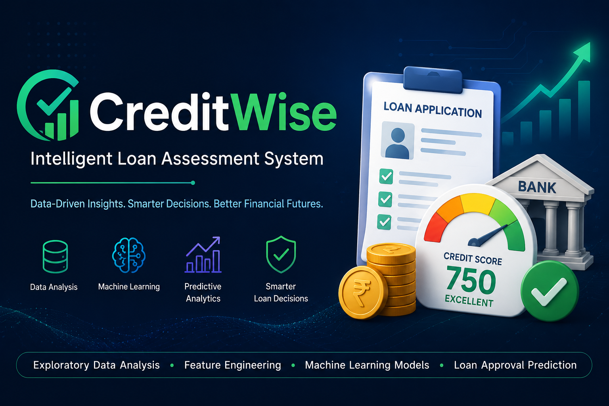
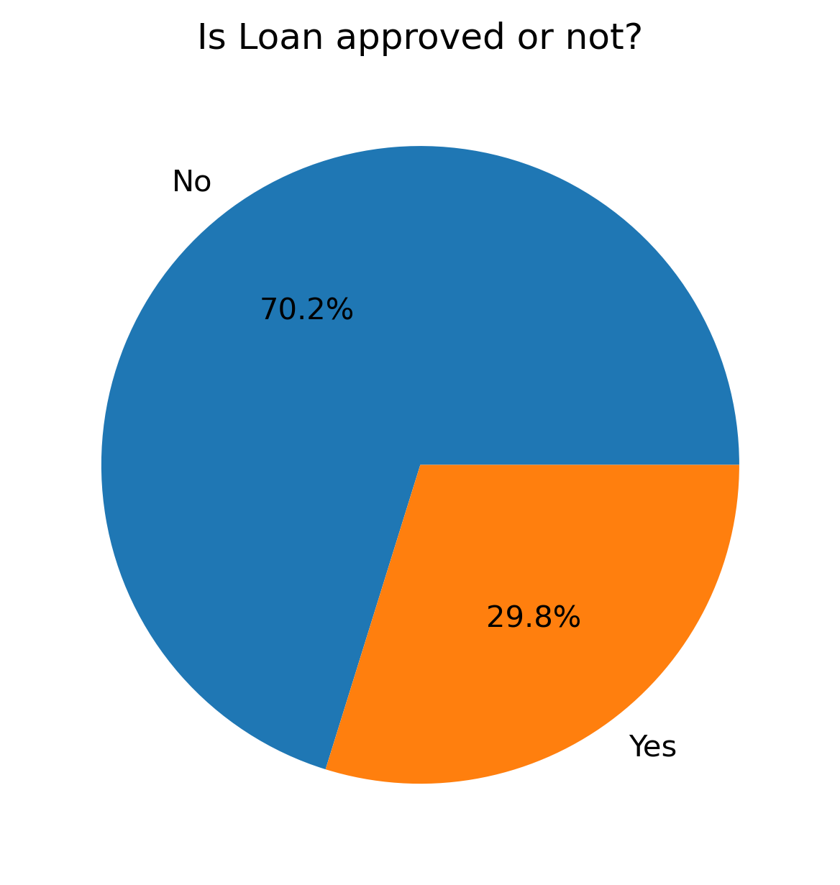
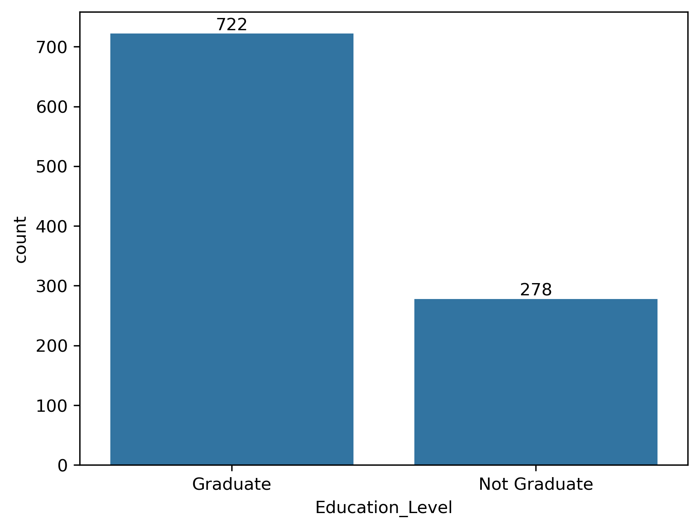
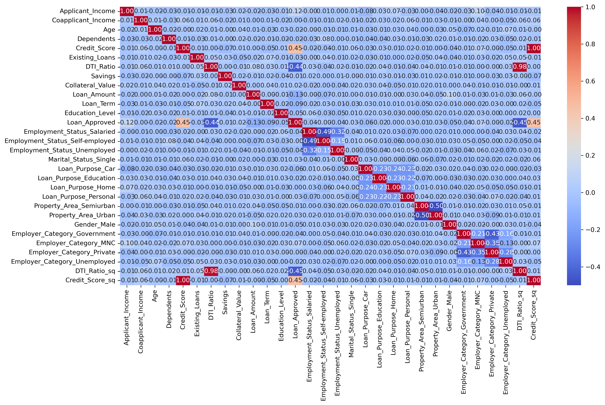
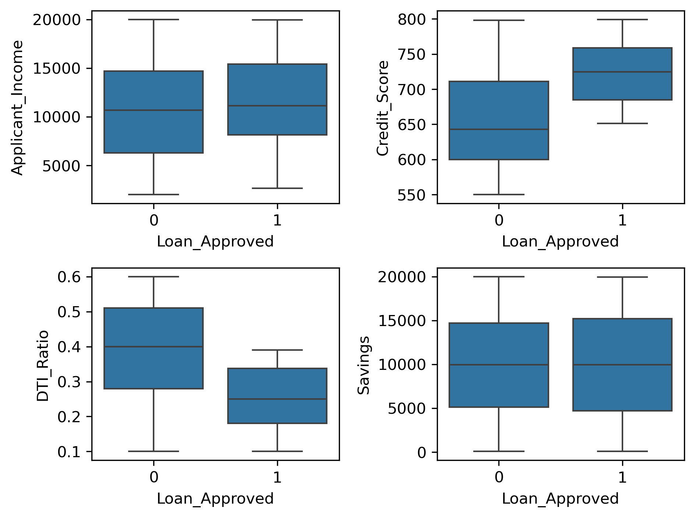
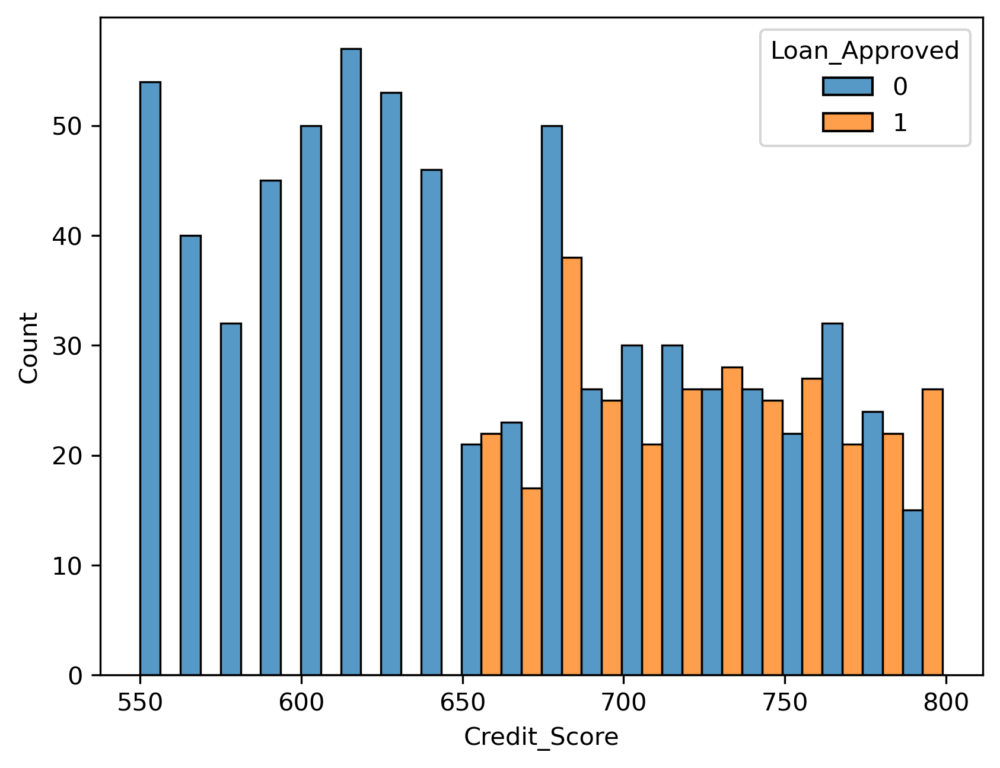

# 🏦 CreditWise – Intelligent Loan Assessment System



# Problem Statement

A mid-sized financial company named SecureTrust Bank offers personal and home loans to customers across urban and rural regions of India. Every day, hundreds of customers apply for loans through online and branch applications.

Until now, SecureTrust Bank has been using a manual verification process where loan officers evaluate applications by checking income proofs, employment details, credit history, and other documents. This process is time-consuming, biased, and inconsistent.

As a result, the bank faces two major challenges:

1. Good customers sometimes get rejected, leading to loss of business.
2. High-risk customers sometimes get approved, leading to financial losses.

To solve this problem, the bank wants to introduce an intelligent loan approval system powered by Machine Learning that can automatically analyse applicant details and predict whether a loan should be Approved or Rejected before final human verification.

---

# Goal of this Project

The objective of this project is to automate the loan approval process based on customer details provided during the loan application process.

The system analyses applicant financial, personal, and credit-related information and predicts whether a loan application should be approved or rejected.

The goal is to:

* Reduce manual effort
* Improve consistency in decision making
* Minimize financial risk
* Speed up loan approval
* Provide unbiased predictions

---

# Hypothesis Generation

Below are the factors that may influence loan approval decisions:

* Applicant with higher income may have higher chances of loan approval.
* Applicants with higher credit scores are more likely to receive loan approval.
* Higher savings balance may improve approval chances.
* Applicants with fewer existing loans may have lower default risk.
* Lower Debt-to-Income Ratio (DTI) may increase approval probability.
* Higher collateral value may positively impact approval decisions.
* Smaller loan amounts may have higher approval chances.
* Stable employment may increase approval probability.

---

# Data Source

The dataset consists of historical loan application records collected by SecureTrust Bank.

Each record represents a loan applicant and contains personal, financial, employment, and credit-related information.

The target variable is:

**Loan_Approved**

* 1 = Approved
* 0 = Rejected

---

# Data Dictionary

| Variable           | Description                             |
| ------------------ | --------------------------------------- |
| Applicant_ID       | Unique applicant ID                     |
| Applicant_Income   | Monthly income of applicant             |
| Coapplicant_Income | Monthly income of co-applicant          |
| Employment_Status  | Salaried / Self-Employed / Business     |
| Age                | Applicant age                           |
| Marital_Status     | Married / Single                        |
| Dependents         | Number of dependents                    |
| Credit_Score       | Credit bureau score                     |
| Existing_Loans     | Number of already running loans         |
| DTI_Ratio          | Debt-to-Income ratio                    |
| Savings            | Savings balance                         |
| Collateral_Value   | Value of collateral provided            |
| Loan_Amount        | Loan amount requested                   |
| Loan_Term          | Loan duration (months)                  |
| Loan_Purpose       | Home / Education / Personal / Business  |
| Property_Area      | Urban / Semi-Urban / Rural              |
| Education_Level    | Graduate / Postgraduate / Undergraduate |
| Gender             | Male / Female                           |
| Employer_Category  | Govt / Private / Self                   |
| Loan_Approved      | Target Variable                         |

---

# Data Cleaning

* Checked missing values
* Removed inconsistencies
* Verified data types
* Prepared data for machine learning models

---

## Exploratory Data Analysis (EDA)

### 1. Loan Approval Distribution

This plot shows the distribution of approved and rejected loan applications.
- Around **70.2%** of loan applications were rejected, while **29.8%** were approved.
- The dataset is **imbalanced**, with significantly more rejected loans than approved loans.
- This imbalance was considered during model development to avoid biased predictions.



---

### 2. Education Level Distribution

This visualization shows the number of Graduate and Non-Graduate applicants in the dataset.
- Most applicants are **Graduates (722)**, whereas **278** applicants are Non-Graduates.
- The dataset contains a much larger proportion of graduate applicants.
- Education level may influence loan approval and was therefore included as one of the predictive features.



---

### 3. Correlation Heatmap

The heatmap illustrates the correlation between numerical features used for loan approval prediction.
- Most features show **low correlation**, indicating minimal multicollinearity within the dataset.
- **Credit Score** has a positive correlation with loan approval, suggesting higher scores improve approval chances.
- **DTI Ratio** is negatively correlated with loan approval, meaning applicants with lower debt relative to income are more likely to receive approval.
- The engineered features (**Credit_Score_sq** and **DTI_Ratio_sq**) capture additional non-linear relationships that improve model performance.



---

### 4. Feature Analysis

Boxplots comparing Applicant Income, Credit Score, Debt-to-Income Ratio (DTI), and Savings against loan approval status.
- Applicants with **higher credit scores** have a greater likelihood of loan approval.
- Approved applicants generally exhibit a **lower Debt-to-Income (DTI) Ratio**, indicating better repayment capacity.
- Applicant income for approved loans is slightly higher on average, although income alone is not a decisive factor.
- Savings show considerable overlap between approved and rejected applicants, suggesting they have a weaker standalone impact on loan approval.



---

### 5. Credit Score vs Loan Approval

This histogram highlights the relationship between applicant credit scores and loan approval outcomes.
- Loan approvals increase noticeably for applicants with **credit scores above approximately 680**.
- Lower credit score ranges contain a higher proportion of rejected applications.
- This indicates that **Credit Score is one of the strongest predictors** of loan approval.



# Feature Engineering

Additional features created:

* DTI_Ratio_sq
* Credit_Score_sq

These features help capture non-linear relationships within the data.

---

# Feature Transformation

### Label Encoding

Applied on:

* Education_Level
* Loan_Approved

### One Hot Encoding

Applied on:

* Employment_Status
* Marital_Status
* Loan_Purpose
* Property_Area
* Gender
* Employer_Category

### Feature Scaling

Used StandardScaler for normalization of numerical features.

---

# Model Building

The following machine learning models were trained and evaluated:

### Logistic Regression

### K-Nearest Neighbors (KNN)

### Gaussian Naive Bayes

---

# Model Evaluation

After performing feature engineering and training the Naive Bayes classifier, the model achieved the following performance on the test dataset.

## Performance Metrics

| Metric | Score |
|--------|-------:|
| Accuracy | **86.50%** |
| Precision | **78.33%** |
| Recall | **77.05%** |
| F1-Score | **77.69%** |

## Confusion Matrix

| Actual \ Predicted | Rejected (No) | Approved (Yes) |
|-------------------|--------------:|---------------:|
| **Rejected (No)** | 126 | 13 |
| **Approved (Yes)** | 14 | 47 |

```text
Confusion Matrix

                 Predicted
               No       Yes
Actual No      126       13
Actual Yes      14       47
```

### Interpretation

- **Accuracy (86.50%)** indicates that the model correctly classified the majority of loan applications.
- **Precision (78.33%)** means that when the model predicts a loan will be approved, it is correct about 78% of the time.
- **Recall (77.05%)** shows that the model successfully identifies around 77% of the actual approved loan applications.
- **F1-Score (77.69%)** provides a balanced measure of precision and recall, demonstrating reliable overall classification performance.
- The confusion matrix shows that the model correctly classified **126 rejected** and **47 approved** loan applications while making **27 misclassifications**.

Overall, the Naive Bayes classifier demonstrated strong performance after feature engineering and is suitable for predicting loan approval based on applicant financial and demographic information.

# Final Model

### Gaussian Naive Bayes

The Gaussian Naive Bayes model was selected as the final model based on its performance on the processed dataset.

---

# Project Workflow

```text
Dataset
   ↓
Data Cleaning
   ↓
Encoding
   ↓
Feature Engineering
   ↓
Scaling
   ↓
Train-Test Split
   ↓
Model Training
   ↓
Model Evaluation
   ↓
Loan Approval Prediction
```

---

## 📚 Technical Learnings

Through this project, I gained hands-on experience in:

- Performed **Exploratory Data Analysis (EDA)** to identify data patterns, feature distributions, and correlations.
- Applied **data preprocessing** techniques including missing value handling and one-hot encoding.
- Implemented **feature engineering** by creating new features (`Credit_Score_sq`, `DTI_Ratio_sq`) to improve model performance.
- Built and evaluated a **Naive Bayes Classification** model using Scikit-learn.
- Assessed model performance using **Accuracy, Precision, Recall, F1-Score, and Confusion Matrix**.
- Saved and loaded the trained model using **Pickle (`model.pkl`)**.

## 💡 Skills Developed

**Machine Learning:** Naive Bayes, Model Evaluation, Feature Engineering  
**Data Analysis:** EDA, Data Preprocessing, Data Visualization, Statistical Analysis  
**Programming:** Python, Pandas, NumPy, Scikit-learn, Matplotlib, Seaborn  
**Deployment:** Streamlit, Pickle, Git, GitHub  
**Professional Skills:** Problem Solving, Analytical Thinking, Data-Driven Decision Making

# Future Improvements

* Explainable AI
* Real-time prediction dashboard
* Web deployment
* Ensemble learning models

---

# Author

**Arpita Wadekar**

Electronics & Communication Engineering
Jain College of Engineering, Belagavi
